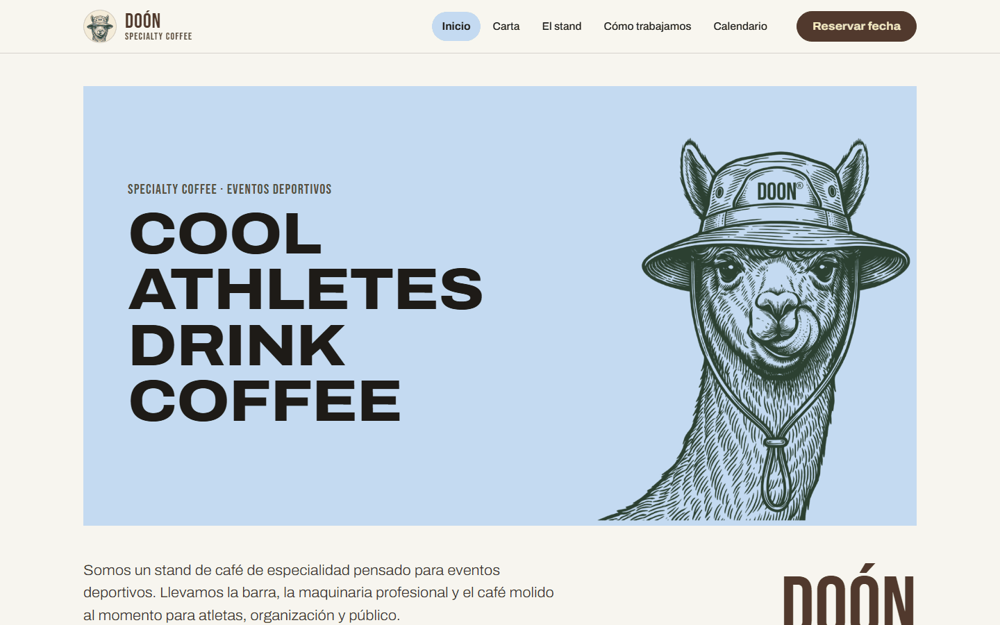
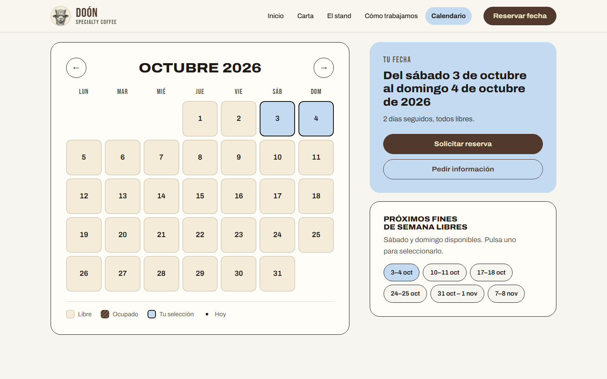
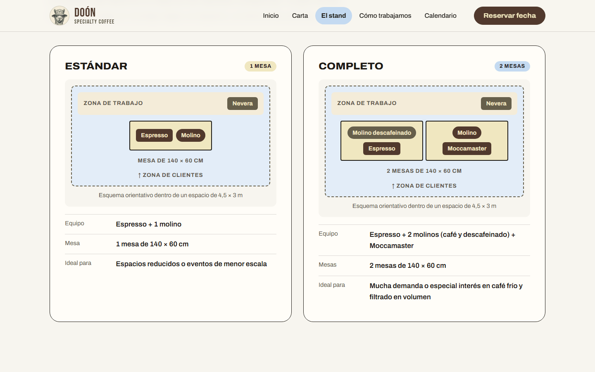
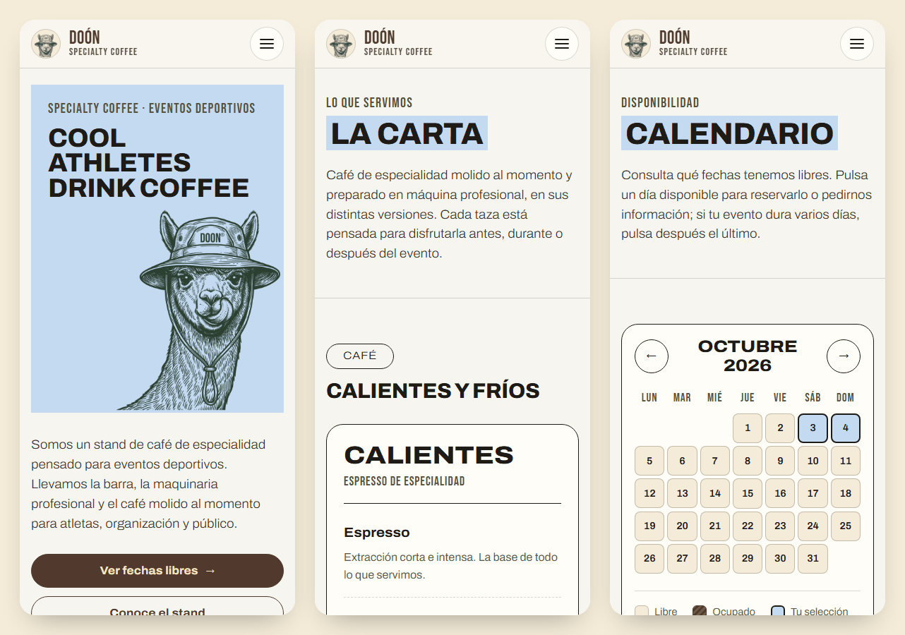

<h1 align="center">DOÓN · Specialty Coffee</h1>

<p align="center">
  <strong>Cool athletes drink coffee.</strong><br>
  Web del stand de café de especialidad para eventos deportivos.<br>
  <a href="https://doon.es"><strong>doon.es</strong></a>
</p>

<p align="center">
  
</p>

## La web

Una web estática, rápida y sin dependencias para presentar el stand, su carta y su forma de trabajar, y para que cualquier organizador consulte las fechas libres y pida una reserva.

| Página | Qué contiene |
|---|---|
| [Inicio](https://doon.es/Inicio/) | Presentación, qué ofrecemos, tipos de evento, experiencia y testimonio |
| [Carta](https://doon.es/carta/) | Cafés calientes y fríos, leche o avena, descafeinado, acompañamientos y marcas deportivas |
| [El stand](https://doon.es/stand/) | Montaje estándar y completo, equipo profesional, qué necesitamos y seguridad alimentaria |
| [Cómo trabajamos](https://doon.es/como-trabajamos/) | Modalidades de servicio, proceso de reserva y preguntas frecuentes |
| [Calendario](https://doon.es/calendario/) | Disponibilidad del stand y formulario de reserva o información |
| [Términos](https://doon.es/terminos/) · [Privacidad](https://doon.es/privacidad/) · [Cookies](https://doon.es/cookies/) | Textos legales |

### Calendario de disponibilidad

Días libres, ocupados y pasados; selección de uno o varios días, próximos fines de semana libres y navegación con teclado. El formulario no deja reservar una fecha ocupada.

<p align="center">
  
</p>

### El stand

<p align="center">
  
</p>

### En el móvil

<p align="center">
  
</p>

## Actualizar la web

Cada cambio que se sube a la rama `main` se publica solo en doon.es en aproximadamente un minuto (Cloudflare Workers, configurado en `wrangler.jsonc`).

**Marcar una fecha como ocupada:** edita [`js/disponibilidad.js`](js/disponibilidad.js) y añade una línea con el primer y el último día:

```js
{ desde: '2026-10-17', hasta: '2026-10-18' },
```

Se puede hacer desde la propia web de GitHub (icono del lápiz → *Commit changes*), también desde el móvil. Ese archivo es público: solo fechas, nunca nombres de eventos ni de clientes.

**Correo de contacto y formulario:** en [`js/config.js`](js/config.js). Si se rellena `formEndpoint` con la dirección de un servicio de formularios, las solicitudes se envían directamente; si se deja vacío, el formulario abre el correo del visitante con la solicitud ya redactada.

## Verla en local

Basta con abrir `index.html` con doble clic. Para probarla como en el servidor:

```bash
python -m http.server 8000
```

y abrir `http://localhost:8000`.

## Estructura

```
├── Inicio/  carta/  stand/  como-trabajamos/  calendario/   páginas (doon.es/carta/…)
├── terminos/  privacidad/  cookies/                         textos legales
├── css/global.css        hoja de estilos única
├── js/config.js          marca, correo, menú y páginas legales
├── js/disponibilidad.js  fechas ocupadas
├── js/layout.js          cabecera y pie comunes (<doon-header>, <doon-footer>)
├── js/calendario.js      calendario y formulario
├── img/  fonts/          logotipo, iconos y tipografías
├── _redirects            doon.es → /Inicio/ y direcciones antiguas
├── robots.txt  sitemap.xml
└── wrangler.jsonc        despliegue en Cloudflare
```

## Cómo está hecha

- **HTML, CSS y JavaScript sin dependencias ni proceso de compilación.** Lo que hay en el repositorio es lo que se publica.
- **Sin código repetido:** una sola hoja de estilos, y la cabecera y el pie se escriben una vez como componentes que usan todas las páginas.
- **Legible en cualquier pantalla:** los títulos se ajustan al ancho de su caja (container queries) para que ninguna palabra se parta ni se salga. Se ha revisado automáticamente cada página en 19 anchos, de 320 a 1920 px, y todo el texto cumple un contraste mínimo de 4,5:1.
- **Privacidad:** sin cookies, sin analítica y sin recursos de terceros. Las tipografías se sirven desde el propio dominio.
- **Accesible:** HTML semántico, enlace para saltar al contenido, menú móvil accesible y calendario manejable con teclado.

## Licencias

Los textos, el logotipo de la llama y el diseño pertenecen a DOÓN, con todos los derechos reservados. Las tipografías [Archivo](fonts/OFL-Archivo.txt) y [Bebas Neue](fonts/OFL-BebasNeue.txt) se distribuyen bajo la licencia SIL Open Font License 1.1.
